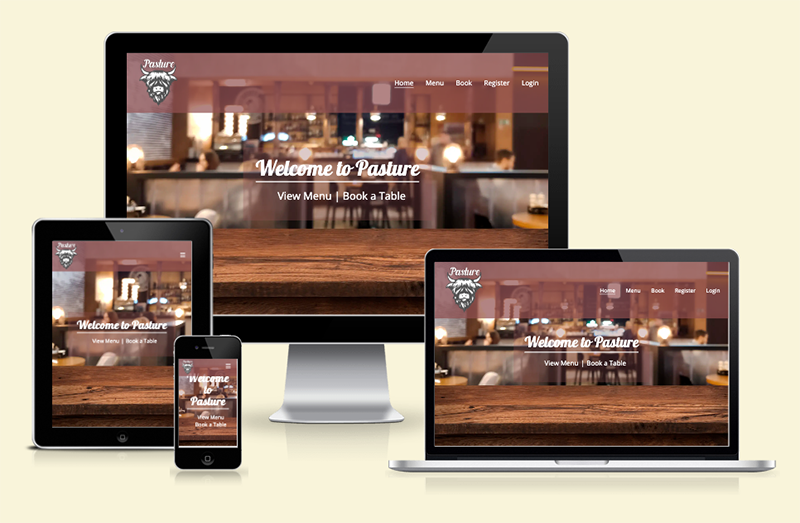
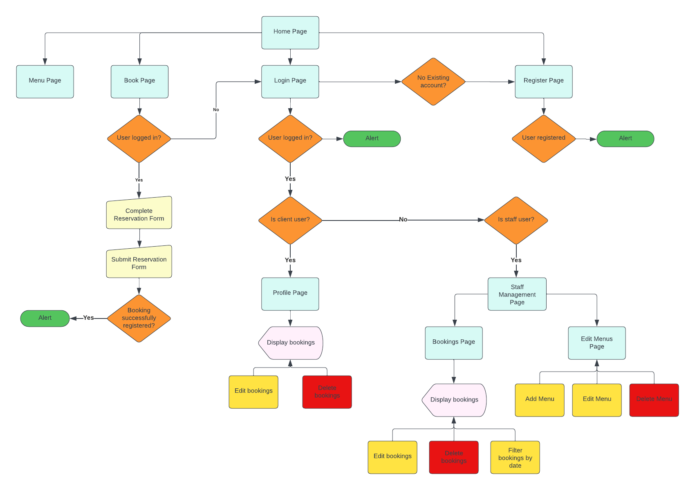
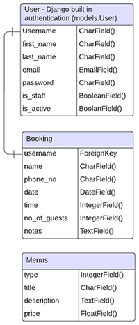
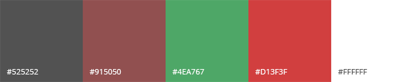
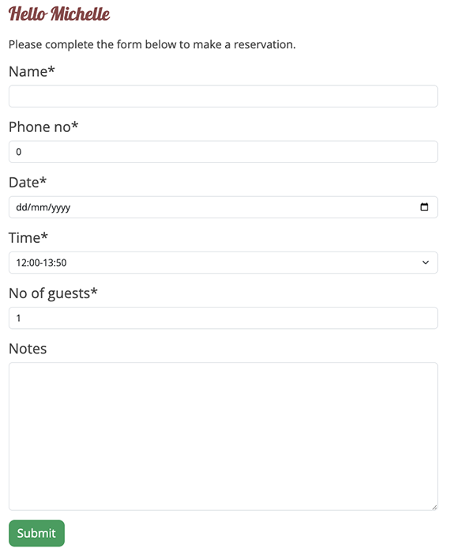
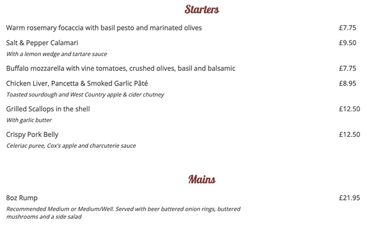
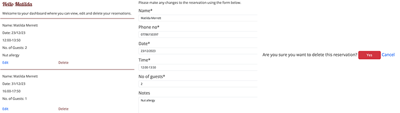
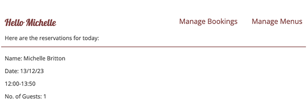

# Portfolio Project 4 - Pasture Steakhouse

## CONTENTS

- [Overview](#overview)
- [UX](#ux)
    - [Strategy](#strategy)
    - [Scope](#scope)
    - [Structure](#structure)
    - [Skeleton](#skeleton)
    - [Surface](#surface)
        - [Colour Scheme](#colour-scheme)
        - [Fonts](#fonts)
        - [Visual Effects](#visual-effects)
- [Agile Methodology](#agile-methodology)
- [Features](#features)
    - [Existing Features](#existing-features)
        - [Create Bookings](#create-bookings)
        - [Menu](#menu)
        - [Profiles](#profiles)
        - [Staff Management](#staff-management)
    - [Potential Future Features](#potential-future-features)
- [Responsive Layout and Design](#responsive-layout-and-design)
- [Tools Used](#tools-used)
    - [Python Packages](#python-packages)
- [Testing](#testing)
- [Deployment](#deployment)
    - [Deploy on Heroku](#deploy-on-heroku)
    - [Fork the respository](#fork-the-repository)
    - [Clone the repository](#clone-the-repository)
- [Credits](#credits)
    - [Content](#content) 
    - [Media](#media)
    - [Code](#code)
- [Acknowledgments](#acknowledgements)

## OVERVIEW 

Pasture is a fictional restaurant located in Bristol. The app is a booking management system for the restaurant, which provides staff with an effective way of handling reservations and updating the menus whilst also providing users with a platform to make and edit their own reservations.

The deployed project can be accessed at this [link](https://pasture-steakhouse-5a621bcf5a63.herokuapp.com/).

## UX

This project was created using the Five Planes of Website Design: 

### Strategy
**User Stories:**
| EPIC                       | ID | USER STORY|
|----------------------------|----|-----------|
|**Initial Setup**           |    |           |
|                            | 1A |As a developer, I need to set up a Kanban Board in GitHub so that I can keep track of user story implementation|
|                            | 1B |As a developer, I need to create the project environment so that it is ready for development|
|                            | 1C |As a developer, I need to create a base template so that the page structure for each page is in place|
|**Content and Navigation**  |    |           |
|                            | 2A |As a user, I want the navigation to be clear and visible so that I can easily navigate through the website|
|                            | 2B |As a user, I want to see the restaurant’s contact details|
|                            | 2C |As a user, I want to see the restaurant’s opening and closing times|
|                            | 2D |As a user, I want to see the restaurant's location|
|                            | 2E |As a user, I want to see relevant information on the website|
|                            | 2F |As a user, I want a pleasant UX experience so that I am encouraged to make a booking|
|**Authentication**          |    |           |
|                            | 3A |As a user, I can create an account so that I can make a reservation|
|                            | 3B |As a user, I can login to my account using my email and password so that my account is secure|
|                            | 3C |As a user, I can log out of my account at any time so that my account is secure|
|                            | 3D |As a user, I can reset my password so that I can keep my account secure and if I have forgotten my password|
|**Booking**                 |    |           |
|                            | 4A |As a logged in user, I want to be able to make a reservation for a specific date and time|
|                            | 4B |As a logged in user, I want to be able to make a reservation for x number of people|
|                            | 4C |As a logged in user, I want to be able to add a note to my reservation detailing any specific requests or details regarding any allergies|
|**User Profiles**           |    |            |
|                            | 5A |As a logged in user, I want to be able to view my reservation|
|                            | 5B |As a logged in user, I want to be able to update my reservation|
|                            | 5C |As a logged in user, I want to be able to delete my reservation|
|                            | 5D |As a logged in staff member, I want to be able to see all reservations|
|                            | 5E |As a logged in staff member, I want to be able to filter the reservations by a specific date so that I can prepare for that day|
|                            | 5F |As a logged in staff member, I want to be able to update reservations on behalf of customers so that I can make the process as easy as possible for a customer|
|                            | 5G |As a logged in staff member, I want to be able to delete reservations on behalf of customers so that I can make the process as easy as possible for a customer|
|**Menu**                    |    |            |
|                            | 6A |As a user, I want to see menus so I can decide whether I would like to make a reservation|
|                            | 6B |As a logged in staff member, I want to be able to add new menus|
|                            | 6C |As a logged in staff member, I want to be able to edit menus|
|                            | 6D |As a logged in staff member, I want to be able to delete menus|
|**Deployment**              |    |            |
|                            | 7A |As a developer, I need to set DEBUG to False in readiness for final deployment|
|                            | 7B |As a developer, I need to do a final deployment to Heroku so that the site is live|

**Project Goal:**

Create a visually appealing website that provides good user experience for both staff members and users.

**Project Objectives:**

- Design a website that provides a simple and intuitive user experience
- Ensure that the website is responsive
- Provide relevant information
- Implement features that will be useful to each user role.
- Have a clear distinction between user roles

### Scope

**Simple and Intuitive User Experience**

- Create a design that is clean and simple with the same layout for each page
- Each page will contain a header and footer
- The navigation will be clearly visible and functional on each page
- Each page will be named appropriately
- All necessary feedback provided to users

**Responsive**

Create a responsive website that is fully functional for desktop, tablet and mobile devices.

**Relevant Content**

- Provide relevant information about the restaurant
- Include information regarding location and contact details
- Include images where necessary

**Features**

- Create a login/register section
- Create a reservation page which will allow users to book a table for a specific date and time (depending on availability), for an x number of people, together with the ability to add notes i.e. if anyone in the party has an allergy etc
- Create a profile page where users can view and manage their reservations
- Create a staff management page where staff can view, filter, edit and delete reservations
- Create a staff management page where staff can add, edit and delete menu items

**Role based Accounts**

- Ensure that users have access to their own profile page
- Ensure that staff members have access to the staff management page

### Structure

The website comprises a total of thirteen pages.  If there has been no authentication the user will only be able to see five pages.  Once logged in as a customer, the customer will also be able to view their own profile page.  If logged in as a staff member, the staff member will be able to see a Staff Management page which links to a Manage Booking page and Edit Menus page. 

**Home Page:** The home page is visible to all users and contains a main image with links to View Menu and Book a table.  Beneath that is some information about the restaurant.

**Menu Page:** The menu page is visible to all users and displays the menu. The menu content is driven by the Manage Menus page below.

**Book Page:** If the user is logged in they will be able to complete a form to make a reservation.  If they are not, they will be informed that that they either need to register or login.

**Register Page:** The register page is visible to all users.

**Login Page:** The login page is visible to all users.

**Profile Page:** The profile page is only visible to logged in customers. This is where they can view their upcoming reservations, edit and delete them.

**Staff Management Page:** This page is only visible to logged in staff members and will contain two links to the following two pages, together with a list of bookings for the current day.

**Manage Bookings Page:** This page is only visible to logged in staff members and will contain a list of all bookings. The user will be able to filter these by name and date, edit and delete bookings.

**Edit Bookings Page:** This page is only visible to logged in users and staff users when they opt to edit an existing booking, and contains a form which is prepopulated with information from the relevant booking, where the user can make any changes and save them.

**Delete Bookings Page:** This page is only visible to logged in users and staff users when they opt to delete an existing booking. This page asks the user to confirm the deletion.

**Manage Menus Page:** This page is only visible to logged in staff members and will contain a list of menus, with the option to edit or delete them.  There will also be the option to add a new menu item.

**Edit Menus Page:** This page is only visible to logged in staff members when they opt to edit an existing menu item, and contains a form which is prepopulated with information from the relevant menu item, where the user can make any changes and save them.

**Delete Menus Page:** This page is only visible to logged in staff members when they opt to delete an existing menu item. This page asks the user to confirm the deletion.

The following flowchart is a visual representation of the site structure created using Lucid Chart.

### Skeleton

#### Wireframes
Figma was used to create wireframes for both mobile and desktop.

[Desktop Wireframe](documentation/wireframes/home-wireframe.pdf)

[Mobile Wireframe](documentation/wireframes/home-mobile-wireframe.pdf)

#### Database
To store data for this project, the PostgreSQL database was used.

**Schema**

### Surface

#### Colour Scheme
I used the logo colour as a base to create a colour palette using Adobe Colour.

#### Fonts
The following fonts were used for this project which were imported from Google Fonts (link)

Galada - used for the logo and headings
Open Sans - used for the body text

#### Visual Effects
- Javascript was used to detect when the user had scrolled down the page and reduce teh size of the header, by replacing the logo image with a smaller text version, as the header takes up a lot of space.
- The main image on the home page has been fixed for a parallax scrolling effect. 
- All links have an animated hover state

### Agile Methodology

This project was developed using the Agile methodology.

All progress of epics and user story implementation was registered using GitHub. As the user stories were accomplished, they were moved in the GitHub Kanban board from **To Do**, to **In Progress**, **Done** and **Not Implemented** lists.

#### Sprint 1
- Epic 1 - Initial Setup
- Epic 2 - Content and Navigation

#### Sprint 2
- Epic 3 - Authentication

#### Sprint 3
- Epic 4 - Booking

#### Sprint 4
- Epic 5 - User Profiles

#### Sprint 5
- Epic 6 - Menu

#### Sprint 6
- Epic 7 - Deployment

## Features
### Existing Features
#### Create Booking
This feature enables logged in users to make a reservation by completing the form. The form fields are Name, Phone Number, Date, Time, Number of Guests and Notes. The date field is a date picker and the time contains specific time slots that the user can select. The system will check if the date and time combination already exists in the database and if so, an alert will appear so the user can select a different date or time otherwise an alert will appear to confirm that the reservation has been made.

#### Menu
The menu page contains a list of all the menu items, with details such as title, description and price and are grouped by type i.e. starter, main etc. This page is populated by items in the database that have been created by staff members via the manage menus page.

#### Profile
User accounts have been created using the Django allauth module. This allows information regarding users' reservations to be displayed on the profile page so that logged in users can view, edit and delete their reservations. Reservations are displayed in a list with each having an edit and delete link. Clicking on the edit link will take you to an edit booking page which contains a form prepopulated with that particular booking's details which the user can change and update. Clicking oon the delete link will take you to the delete booking page where they are asked to confirm that they wish to delete the booking.

#### Staff Management
The staff management page displays the bookings for the current day, and if there are no bookings, it will display "There are no reservations for today". There is a sub navigation at the top right of the content area, containing links to the Manage Bookings and Manage Menus pages.

