# Testing

Back to [README.MD](README.MD)

## CONTENTS

- [Manual Testing](#manual-testing)
- [Browser Testing](#browser-testing)
- [Validator Testing](#validator-testing)
- [Accessibility Testing](#accessibility-testing)
- [Bugs](#bugs)

## Manual Testing
|User Story:             |As a user, I want the navigation to be clear and visible so that I can easily navigate through the website|
|:--                     |:--                                                                                                       |
|**Acceptance Criteria:**|The site navigation should be easily accessible and consistent on every page so the user can visit all pages|
|**Summary**             |- When a user visits the site, the navigation is at the top of every page - When a user scrolls down the page, the navigation stays fixed at the top of the screen - When a user navigates through the pages on the site, the navigation remains in the same place - When a user is logged in, the Register and Login links are replaced with the appropriate profile (either Profile or Staff Management) link and a log out link - The user's current page is clearly marked in the navigation|     
|**Outcome**             |All features tested and passed.|     
|**User Story:**        |**As a user, I want to see the restaurant’s contact details**|
|**Acceptance Criteria:**|The user should be able to easily find the contact details so that they can contact the restaurant|
|**Summary**             |- The contact details are positioned within the footer of each page|     
|**Outcome**             |All features tested and passed.|  
|**User Story:**         |**As a user, I want to see the restaurant’s opening and closing times**|
|**Acceptance Criteria:**|The user should be able to easily find the opening and closing times|
|**Summary**             |- The opening and closing times are positioned within the footer of each page|     
|**Outcome**             |All features tested and passed.| 
|**User Story:**         |**As a user, I want to see the restaurant's location**|
|**Acceptance Criteria:**|The user should be able to easily find the restaurant's location|
|**Summary**             |- The address of the restaurant is positioned within the footer of each page|     
|**Outcome**             |All features tested and passed.| 
|**User Story:**         |**As a user, I want to see relevant information on the website**|
|**Acceptance Criteria:**|The user should be able to easily find information about the restaurant and the food they serve so that they can make an informed choice as to whether to make a reservation|
|**Summary**             |- On the home page there is some text that gives a brief overview of the restaurant - There is a menu page which details all of the food served|     
|**Outcome**             |All features tested and passed.| 
|**User Story:**         |**As a user, I want a pleasant UX experience so that I am encouraged to make a booking**|
|**Acceptance Criteria:**|Create an attractive, intuitive design that will make a user want to return|
|**Summary**             |- The home page is a simple, clean design that immediately encourages a user to view the menu or book a table - The user only has to scroll down a little to view more information about the restaurant and to see all of the relavant information - The colours are warm and welcoming which enhance the feeling of a family run restaurant - The logo contains a picture of a cow which suggests the nature of the restaurant - Alerts are provided as feedback to user actions|     
|**Outcome**             |All features tested and passed.| 
|**User Story:**         |**As a user, I can create an account so that I can make a reservation**|
|**Acceptance Criteria:**|A user should be able to register for an account by filling in a form|
|**Summary**             |- The user can navigate to the Register page which displays a form for the user to fill out - The user can enter a username, email and password - Once the form has been completed and submitted an entry is created in the database - A popup alert message appears to confirm that the user is signed in|     
|**Outcome**             |All features tested and passed.| 
|**User Story:**         |**As a user, I can login to my account using my username and password so that my account is secure**|
|**Acceptance Criteria:**|A user should be able to login by entering their username and password|
|**Summary**             |- The user can login by navigating to the Login page where a form is displayed allowing the user to login with their username and password - A popup alert message appears to confirm that the user is signed in|     
|**Outcome**             |All features tested and passed.|
|**User Story:**         |**As a user, I can log out of my account at any time so that my account is secure**|
|**Acceptance Criteria:**|A user should be able to log out|
|**Summary**             |- When a user is logged in, there is a Logout link in the navigation - When the Logout link has been clicked it takes you to a logout confirmation page for the user to confirm that they wish to log out - A popup alert message appears to confirm that the user has been signed out|     
|**Outcome**             |All features tested and passed.|
|**User Story:**         |**As a user, I can reset my password so that I can keep my account secure and if I have forgotten my password**|
|**Acceptance Criteria:**|A user should be able to reset their password|
|**Summary**             |- On the Login page there is a 'Forgot Password' link - There is the facility within the allauth package for a reset password link to be emailed to the user but in order to set this up there needs to be an smtp server so as a workaround for this project password reset links are saved in a file|     
|**Outcome**             |All features tested and passed.|
|**User Story:**         |**As a logged in user, I want to be able to make a reservation for a specific date and time**|
|**Acceptance Criteria:**|A logged in user should be able to complete a form to make a reservation|
|**Summary**             |- If a user clicks on the Book page they will be prompted to either register or login - Once logged in, the user will be able to complete a form, entering their name, phone number, date, time, number of guests and notes - When the form has been completed a check will be made to see if the date/time combination already exists in the database - If there is an existing reservation in the database for that date/time combination an error message will pop up informing the user that slot is not available - If there is no existing reservation in the database a success message will pop up and the user redirected to their Profile page|     
|**Outcome**             |All features tested and passed.|
|**User Story:**         |**As a logged in user, I want to be able to make a reservation for x number of people**|
|**Acceptance Criteria:**|A logged in user should be able to make a reservation for as many people as they need|
|**Summary**             |- Within the booking form there is a field for number of guests|     
|**Outcome**             |All features tested and passed.|
|**User Story:**         |**As a logged in user, I want to be able to add a note to my reservation detailing any specific requests or details regarding any allergies**|
|**Acceptance Criteria:**|- A logged in user should be able to add a note for staff when making a reservation|
|**Summary**             |- Within the booking form there is a field for users to add a note|     
|**Outcome**             |All features tested and passed.|
|**User Story:**         |**As a logged in user, I want to be able to view my reservation**|
|**Acceptance Criteria:**|A logged in user should be able to view all of their reservations on one page|
|**Summary**             |- The Profile page is visible to logged in users but not available to staff members - This page contains a list of all reservations made by the logged in user - Each reservation contains all the details originally entered in the booking form|     
|**Outcome**             |All features tested and passed.|
|**User Story:**         |**As a logged in user, I want to be able to update my reservation**|
|**Acceptance Criteria:**|A logged in user needs to be provided with the functionality to click on a reservation and edit a pre-populated form with updated details|
|**Summary**             |- The Profile page contains a list of reservations made by the user, each reservation has a link to edit the reservation - When the edit link is clicked on, the user is taken to the edit booking page which contains a form with all of the reservation details - The user can change the details and click on the edit button to save the changes to the database - An alert message appears to show whether this action has been successful or not|     
|**Outcome**             |All features tested and passed.|
|**User Story:**         |**As a logged in user, I want to be able to delete my reservation**|
|**Acceptance Criteria:**|A logged in user needs to be provided with the functionality to delete a reservation|
|**Summary**             |- The Profile page contains a list of reservations made by the user, each reservation has a link to delete it - When the delete link is clicked on, the user is taken to the delete booking page where they are asked to confirm the action or they can cancel and return to the Profile page - Once deleted the user is redirected back to the Profile page|     
|**Outcome**             |All features tested and passed.|
|**User Story:**         |**As a logged in staff member, I want to be able to see all reservations**|
|**Acceptance Criteria:**|A logged in staff member should be able to view all reservations on one page|
|**Summary**             |- When a staff member is logged in they can view the Staff Management page which shows the reservations for the current day - There is a sub navigation in the top right of the content area which contains a link to manage the bookings - When that link is clicked on the user is taken to a page where all of the reservations are listed|     
|**Outcome**             |All features tested and passed.|
|**User Story:**         |**As a logged in staff member, I want to be able to filter the reservations by a specific date so that I can prepare for that day**|
|**Acceptance Criteria:**|A logged in staff member should be able to search for reservations by date|
|**Summary**             |- On the Manage Bookings page all reservations are shown by default - There is a form at the top of the page with two fields - name and date - The user can filter bookings by either name (does not need to be the full name) or date|     
|**Outcome**             |All features tested and passed.|
|**User Story:**         |**As a logged in staff member, I want to be able to update reservations on behalf of customers so that I can make the process as easy as possible for a customer**|
|**Acceptance Criteria:**|A logged in staff member needs to be provided with the functionality to update any reservation|
|**Summary**             |- The Manage Bookings page contains a list of reservations made by all users, each reservation has a link to edit the reservation - When the edit link is clicked on, the user is taken to the edit booking page which contains a form with all of the reservation details - The user can change the details and click on the edit button to save the changes to the database - An alert message appears to show whether this action has been successful or not|     
|**Outcome**             |All features tested and passed.|
|**User Story:**         |**As a logged in staff member, I want to be able to delete reservations on behalf of customers so that I can make the process as easy as possible for a customer**|
|**Acceptance Criteria:**|A logged in staff member needs to be provided with the functionality to delete any reservation|
|**Summary**             |- The Manage Bookings page contains a list of reservations made by all users, each reservation has a link to delete it - When the delete link is clicked on, the user is taken to the delete booking page where they are asked to confirm the action or they can cancel and return to the Manage Bookings page - Once deleted the user is redirected back to the Manage Bookings page|     
|**Outcome**             |All features tested and passed.|
|**User Story:**         |**As a user, I want to see menus so I can decide whether I would like to make a reservation**|
|**Acceptance Criteria:**|All users should be able to access a menu page and view menu items|
|**Summary**             |- The Menu link is located in the main navigation and is accessible to all users - All menu items are listed on the Menu page and are grouped by type ie. Starters, Mains etc - Each menu item contains a title and price, with an optional description field - The menu items are populated from entries in the database|     
|**Outcome**             |All features tested and passed.|
|**User Story:**         |**As a logged in staff member, I want to be able to add new menus**|
|**Acceptance Criteria:**|A logged in staff member should be able to create new menu items|
|**Summary**             |- When a staff member is logged in they have access to the sub navigation contained with the Staff Management section which contains a link to Manage Menus - On the Manage Menus page there is a form which the staff member can complete and submit - The available fields are Type (required), Title (required), Description (optional) and Price (required) - When the form has been submitted, an alert message will appear to inform the user whether it has been successful or not - If successful, the menu item will then appear both on the Menu page and also beneath the form on the Manage Menus page|     
|**Outcome**             |All features tested and passed.|
|**User Story:**         |**As a logged in staff member, I want to be able to edit menus**|
|**Acceptance Criteria:**|A logged in staff member needs to be provided with the functionality to update any menu items|
|**Summary**             |- The Manage Menus page contains a list of all menu items, each menu item has a link to edit it - When the edit link is clicked on, the staff member is taken to the edit menus page which contains a form with all of the menu item details - The staff member can change the details and click on the edit button to save the changes to the database - An alert message appears to show whether this action has been successful or not|     
|**Outcome**             |All features tested and passed.|
|**User Story:**         |**As a logged in staff member, I want to be able to delete menus**|
|**Acceptance Criteria:**|A logged in staff member needs to be provided with the functionality to delete any menu items|
|**Summary**             |- The Manage Menus page contains a list of all menu items, each menu item has a link to delete it - When the delete link is clicked on, the user is taken to the delete menu page where they are asked to confirm the action or they can cancel and return to the Manage Menus page - Once deleted the user is redirected back to the Manage Menus page|     
|**Outcome**             |All features tested and passed.|

## Browser Testing
To ensure that the website and features work well across a multitude of browsers, I used BrowserStack to fully test using a number of browsers, operating systems and devices. 

Full testing was performed on the following: 

- iPhone 13 - Safari and Chrome
- iPhone 14 - Safari and Chrome
- iPHone 14 Pro - Safari and Chrome
- iPhone 14 Plus - Safari and Chrome
- iPhone 12 Mini - Safari and Chrome
- iPad 10th Gen - Safari and Chrome
- iPad Air 5 - Safari and Chrome
- iPad Pro 11 - Safari and Chrome
- Samsung Galaxy S22 - Chrome and Firefox
- Samsung Galaxy S23 Ultra - Chrome and Firefox
- Samsung Galaxy 8 - Chrome and Firefox
- Samsung Galaxy Note 20 - Chrome and Firefox
- Windows 11 - Edge 120
- Windows 11 - Firefox 120
- Windows 11 - Chrome 120
- Windows 10 - Edge 119
- Windows 10 - Firefox 119
- Windows 10 - Chrome 119
- Windows 7 - Edge 109
- Windows 7 - Firefox 112
- Windows 7 - Chrome 109
- Mac Ventura - Safari 16.5
- Mac Ventura - Chrome 120
- Mac Ventura - Firefox 120
- Mac Ventura - Edge 120
- Mac Sierra - Safari 10.1
- Mac Sierra - Firefox 115
- Mac Sierra - Chrome 103
- Mac Sierra - Edge 103

## Validator Testing
### W3C HTML Validator

No errors were returned when passing through the official W3C Validator.  The following pages have been tested:

- Home
- Menu
- Book
- Register
- Login
- Logout
- My Profile
- Edit Booking
- Delete Booking
- Staff Profile
- Manage Bookings
- Manage Menus
- Edit Menu
- Delete Menu

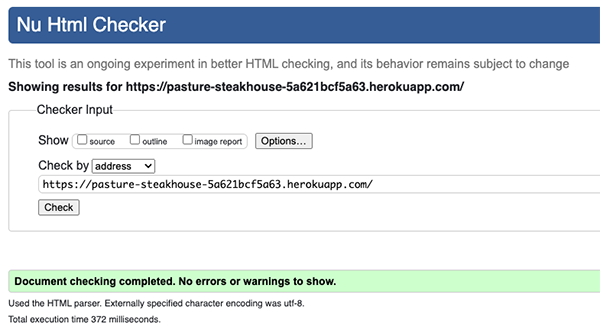

### Jigsaw CSS Validator

No errors were found when passing through the official Jigsaw validator.

### Javascript Validator

When validating the Javascript one undefined variable relating to Bootstrap was found.  I have chosen to ignore this as I believe there is no fix for this. 

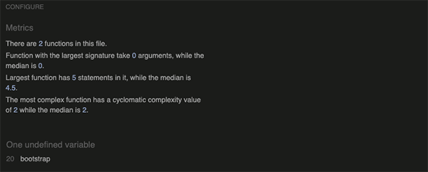

### Python Validator

I used the Code Institute PEP8 Python Linter to validate my Python code and ensure it was free from errors.

#### admin.py

#### apps.py

#### filters.py

#### forms.py

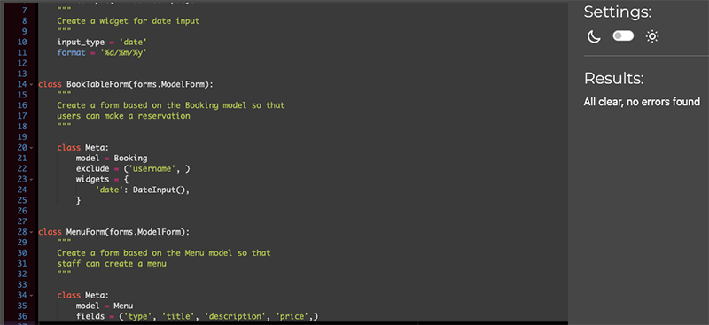

#### models.py

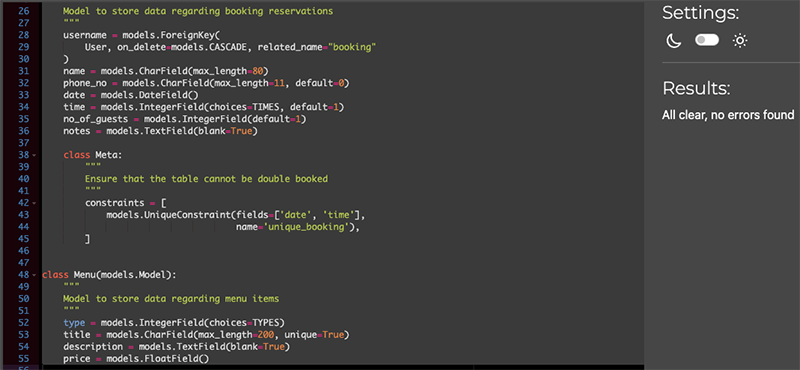

#### views.py

## Accessibility Testing
### Lighthouse

In order to test performance and accessibility, I used Lighthouse within the Chrome Developer Tools.

#### Home

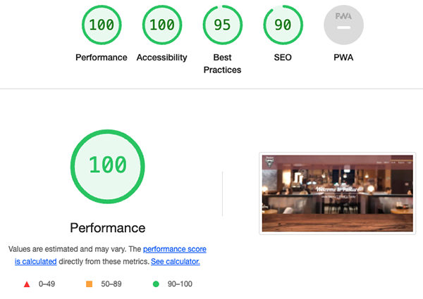

#### Menu

#### Book

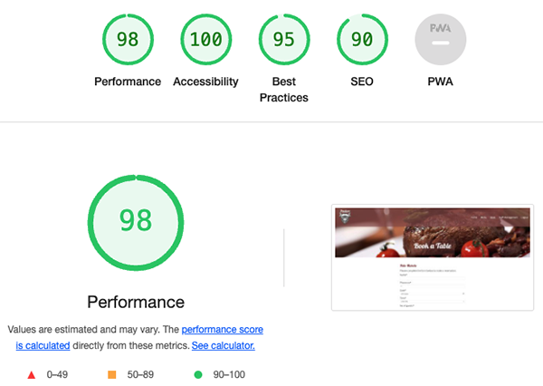

#### Register

#### Login

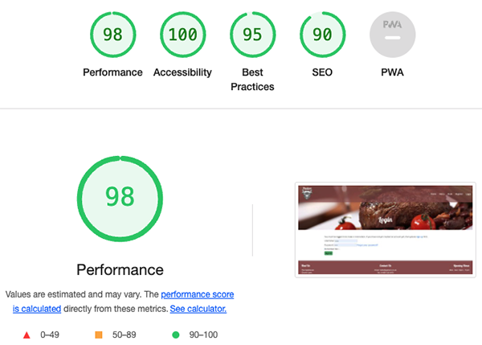

#### My Profile

#### Edit Booking

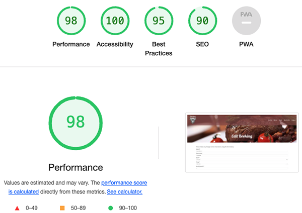

#### Delete Booking

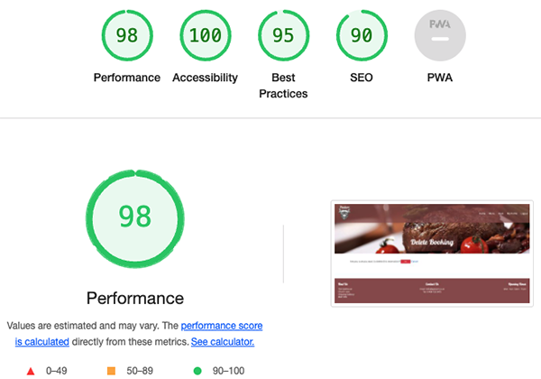

#### Staff Profile

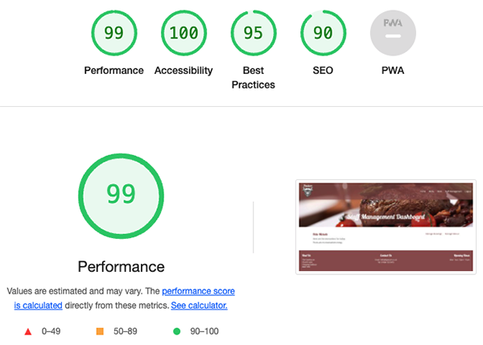

#### Manage Bookings

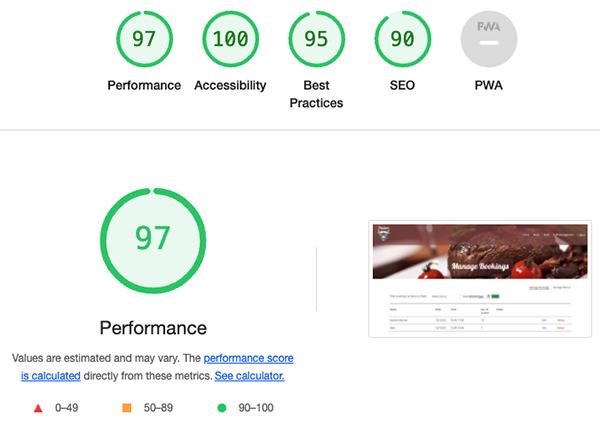

#### Manage Menus

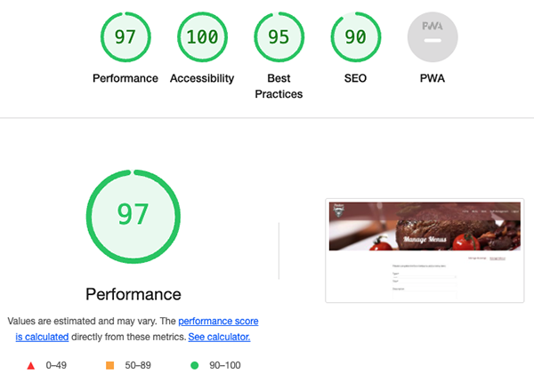

#### Edit Menus

#### Delete Menus

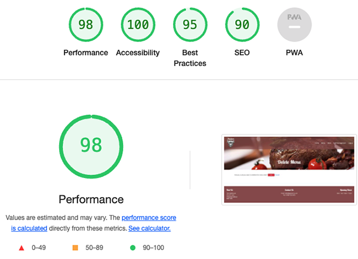

### WAVE
Further accessibility testing was undertaken with WAVE.

#### Home

#### Menu

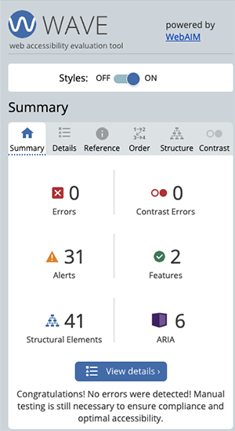

#### Book

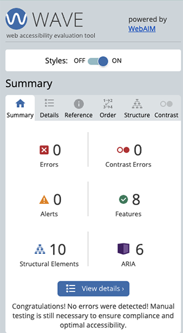

#### Register

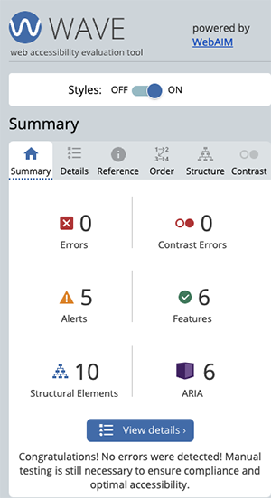

#### Login

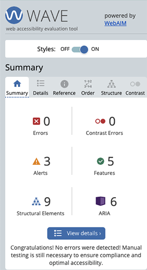

#### My Profile

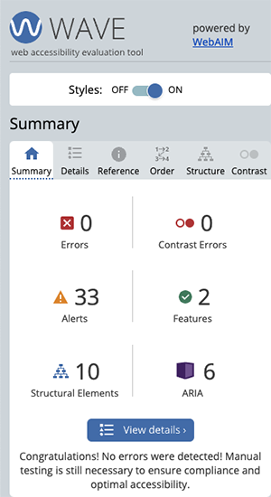

#### Edit Booking

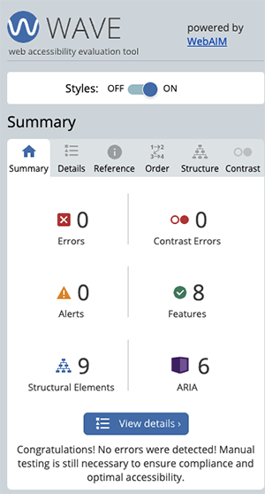

#### Delete Booking

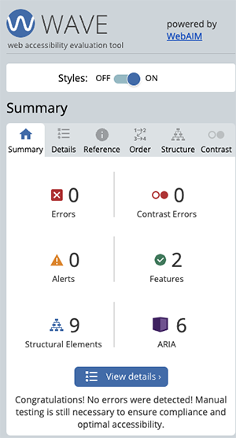

#### Staff Profile

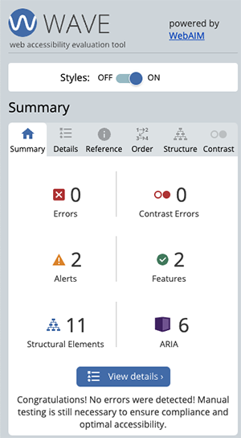

#### Manage Bookings

#### Manage Menus

#### Edit Menus

#### Delete Menus

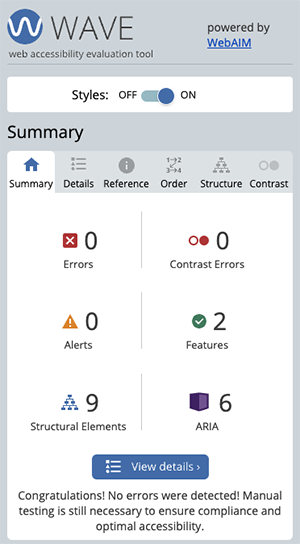

## Bugs

When making a reservation it was found that bookings could be made using a date from the past.  To fix this I add a clean function to the forms.py to test whether the date is in the past and if so throw an exception error.

Back to [README.MD](README.MD)
